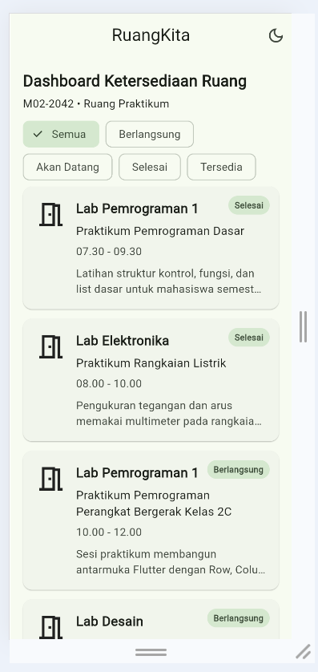
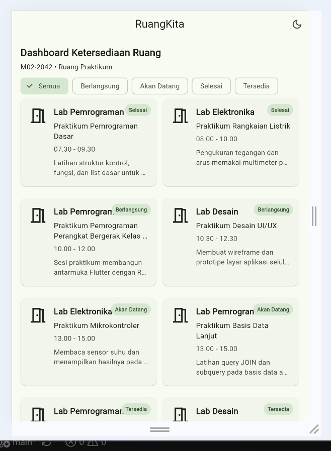
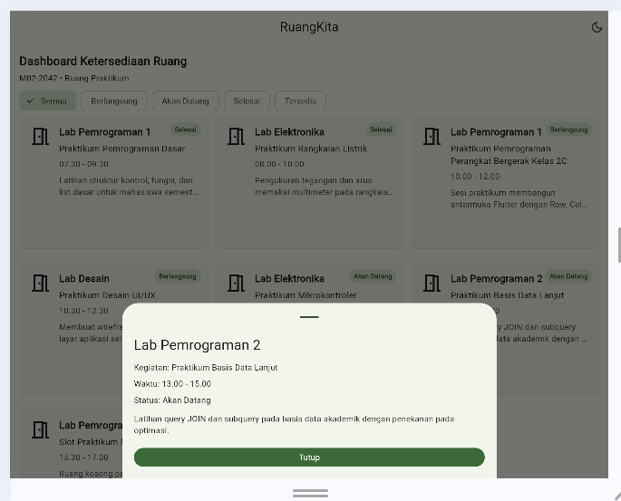
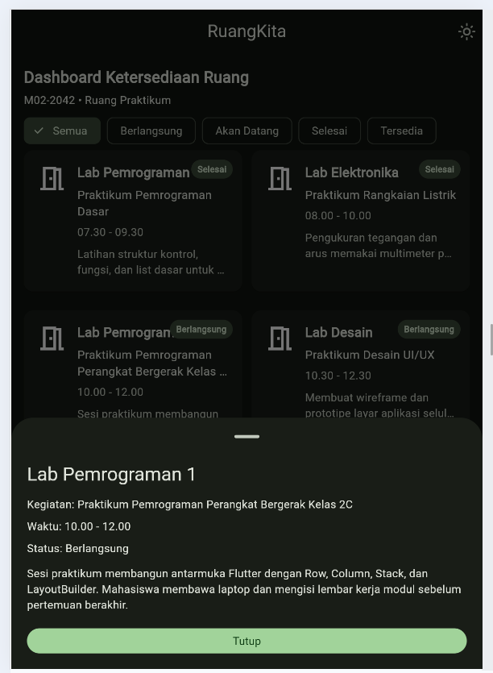
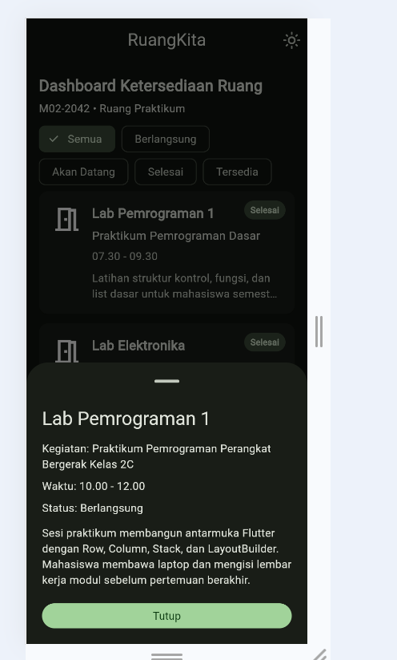

# Laporan Tugas Rumah Modul 02: Declarative UI & Responsive Layout

* **Nama**: Fasaufa Fiaunila

* **NIM**: 362558302042

* **Kelas / Prodi**: 2C / Sarjana Terapan Teknologi Rekayasa Perangkat Lunak

* **Digit Terakhir NIM**: 2

* **Dosen Pengampu**: Sepyan Purnama Kristanto, M.Kom.

* **Domain Aplikasi**: Ruang Praktikum

* **Nama Aplikasi**: RuangKita - Dashboard Ketersediaan Ruang Praktikum

* **Kode Identitas UI Wajib**: M02-2042

* **Mata Kuliah**: Pemrograman Perangkat Bergerak

---

## 1. Arsitektur Widget

RuangKita - Dashboard Ketersediaan Ruang Praktikum merupakan aplikasi Flutter yang digunakan untuk menampilkan informasi kegiatan praktikum, nama ruang, waktu kegiatan, status kegiatan, dan deskripsi kegiatan.

Aplikasi menggunakan konsep Declarative UI dengan Material Design 3. Data kegiatan disimpan secara lokal menggunakan model `RoomSession`, sedangkan tampilan kartu kegiatan dibuat menggunakan widget `RoomSessionCard`.

Halaman utama menggunakan `StatefulWidget` karena terdapat perubahan state pada filter status. Aplikasi utama juga menggunakan `StatefulWidget` untuk mengatur perubahan Light Mode dan Dark Mode.

Responsivitas tampilan menggunakan `LayoutBuilder` dengan tiga kondisi layar, yaitu layar mobile dengan satu kolom, tablet dengan dua kolom, dan layar lebar dengan tiga kolom.

---

## 2. Layout Responsif

| Lebar | Layout |
|---|---|
| < 600 dp | ListView — 1 kolom |
| 600–839 dp | GridView — 2 kolom |
| ≥ 840 dp | GridView — 3 kolom |

Layout ditentukan menggunakan `LayoutBuilder`.

Pada aplikasi ini `LayoutBuilder` berada di dalam `Expanded`. `Expanded` digunakan agar bagian daftar card mendapatkan sisa ruang yang tersedia di dalam `Column`, sehingga `ListView` atau `GridView` mendapatkan batas tinggi yang jelas. Setelah itu `LayoutBuilder` membaca `constraints.maxWidth` untuk menentukan layout yang digunakan.

---

## 3. Komponen Utama

`Wrap + ChoiceChip` digunakan untuk filter status.

`LayoutBuilder` digunakan untuk responsive layout.

`Stack + Positioned` digunakan untuk badge status.

`Expanded` digunakan untuk memberikan ruang yang sesuai pada widget teks di dalam `Row` dan `Column`.

`showModalBottomSheet` digunakan untuk menampilkan detail kegiatan.

Material 3 digunakan dengan Light Mode dan Dark Mode.

---

## 4. Bukti Tangkapan Layar Running App

Seluruh screenshot aplikasi harus menampilkan kode identitas **M02-2042** pada header aplikasi.

### 4.1 Mobile Light Mode — Compact

**Ukuran:** `< 600dp`

**Layout:** 1 kolom

Tampilan mobile menggunakan satu kolom agar informasi pada setiap card tetap mudah dibaca pada layar yang memiliki ruang terbatas.

### 4.2 Tablet Light Mode — Medium

**Ukuran:** `600–839dp`

**Layout:** 2 kolom

Tampilan tablet menggunakan dua kolom sehingga ruang layar yang lebih lebar dapat dimanfaatkan.

### 4.3 Desktop Light Mode — Expanded

**Ukuran:** `≥ 840dp`

**Layout:** 3 kolom

Tampilan Expanded menggunakan tiga kolom karena lebar layar sudah mencukupi untuk menampilkan lebih banyak card secara bersamaan.

### 4.4 Tablet Dark Mode

**Ukuran:** `600–839dp`

**Layout:** 2 kolom

Screenshot ini menunjukkan perubahan tampilan aplikasi setelah tombol mode tema pada AppBar ditekan.

### 4.5 Mobile Dark Mode

**Ukuran:** `< 600dp`

**Layout:** 1 kolom

Screenshot ini menunjukkan tampilan aplikasi pada ukuran mobile setelah Dark Mode diaktifkan.

---

## 5. Tautan Commit Final Repository

**Tautan Repository GitHub**: https://github.com/fasaufafiaunila-creator/ruangkita-modul02-2042.git

**Tautan Commit Final GitHub**: https://github.com/fasaufafiaunila-creator/ruangkita-modul02-2042/commit/bce1c08

Commit yang digunakan selama pengerjaan Modul 02:

1. `chore(m02): create initial flutter project`

2. `feat(m02): add room session model and dummy data`

3. `fix(m02): complete room session model and dummy data`

4. `feat(m02): build compact room cards UI mobile 1 kolom`

5. `feat(m02): add responsive breakpoints LayoutBuilder medium/expanded`

6. `feat(m02): add filters and bottom sheet setState + interaction`

7. `fix(m02): handle overflow and dark theme`

---

## 6. Jawaban Pertanyaan Refleksi Teknis

### (1) Mengapa `Expanded` Membantu Widget `Text` di Dalam `Row`?

`Row` memiliki ruang horizontal yang terbatas, sehingga teks yang terlalu panjang dapat menyebabkan `RenderFlex overflow`. Dengan menggunakan `Expanded`, widget `Text` akan menyesuaikan diri dengan sisa ruang yang tersedia.

Pada aplikasi ini, `Text` juga menggunakan `maxLines` dan `TextOverflow.ellipsis` sehingga teks panjang dapat dibatasi dan ditampilkan dengan aman di dalam card.

### (2) Mengapa `LayoutBuilder` Cocok untuk Layout Lokal?

`MediaQuery` digunakan untuk mengetahui ukuran layar secara keseluruhan, sedangkan `LayoutBuilder` membaca batas ukuran dari parent widget secara langsung melalui `BoxConstraints`.

Karena pada aplikasi ini layout perlu menyesuaikan dengan ruang yang tersedia pada bagian daftar card, `LayoutBuilder` digunakan untuk menentukan jumlah kolom berdasarkan `constraints.maxWidth`.

Pada aplikasi ini pembagiannya adalah kurang dari 600 dp menggunakan satu kolom, 600–839 dp menggunakan dua kolom, dan 840 dp atau lebih menggunakan tiga kolom.

### (3) Apa yang Terjadi Ketika `setState()` Dipanggil?

Ketika `setState()` dipanggil, Flutter menandai `State` sebagai perlu diperbarui dan menjalankan kembali metode `build()`.

Pada aplikasi ini `setState()` digunakan pada filter status dan perubahan tema. Ketika pilihan filter berubah, data yang ditampilkan disaring kembali berdasarkan status yang dipilih. Pada perubahan tema, `ThemeMode` diperbarui sehingga tampilan aplikasi berubah antara Light Mode dan Dark Mode.

---